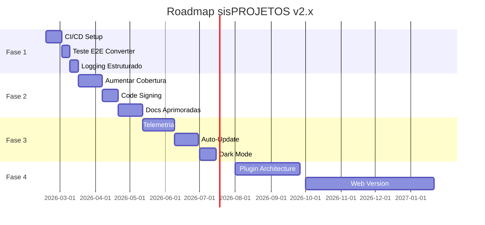

# 🚀 Próximos Passos - sisPROJETOS v2.0

**Data**: 2026-02-17  
**Status Atual**: Score 9.5/10 ✅  
**Base**: Auditoria Completa + Correções Aplicadas

---

## 📊 Situação Atual

### ✅ Concluído
- [x] Auditoria completa de código
- [x] Correção de bugs críticos (database schema, fastkml)
- [x] Qualidade de código (0 erros críticos)
- [x] Segurança (0 vulnerabilidades CodeQL)
- [x] Testes (118/118 passando - 100%)
- [x] Documentação profissional

### 📈 Métricas Atuais
- **Score Geral**: 9.5/10
- **Cobertura de Testes**: ~75%
- **Linhas de Código**: ~5000 (estimado)
- **Módulos**: 9 principais
- **Dependências**: 15 principais

---

## 🎯 Plano de Ação - Roadmap

### 🔴 Fase 1: Automação e Qualidade (2-4 semanas)

#### 1.1 CI/CD com GitHub Actions ⭐ PRIORIDADE #1

**Objetivo**: Automatizar testes, build e deploy

**Tarefas**:
- [ ] Criar workflow de CI (`.github/workflows/ci.yml`)
  - Rodar testes em cada push/PR
  - Verificar qualidade de código (flake8)
  - Gerar relatório de cobertura
- [ ] Criar workflow de Release (`.github/workflows/release.yml`)
  - Build do executável com PyInstaller
  - Upload de artefatos
  - Criar GitHub Release automaticamente
- [ ] Configurar proteção de branches
  - Exigir testes passando para merge
  - Exigir aprovação de PR
- [ ] Adicionar badges no README
  - Status dos testes
  - Cobertura de código
  - Versão da release

**Benefícios**:
✅ Detecta bugs antes de produção  
✅ Build consistente e reproduzível  
✅ Deploy automático de releases  
✅ Facilita colaboração

**Estimativa**: 8-16 horas

---

#### 1.2 Teste End-to-End do Conversor KML ⭐ PRIORIDADE #2

**Objetivo**: Garantir que conversão KML funciona em produção

**Tarefas**:
- [ ] Adicionar arquivo KML de teste ao repositório
  - `tests/fixtures/test_project.kml`
  - Incluir pontos, linhas e polígonos
- [ ] Criar teste E2E completo
  - Carregar KML → Converter → Exportar (3 formatos)
  - Validar arquivos gerados
  - Verificar conteúdo e estrutura
- [ ] Adicionar ao CI
  - Rodar em cada commit
  - Falha se conversão quebrar

**Código de Exemplo**:
```python
# tests/test_converter_e2e.py
def test_full_kml_conversion_pipeline():
    """Teste completo: KML → XLSX/CSV/DXF"""
    kml_path = "tests/fixtures/test_project.kml"
    
    # Carregar
    converter = ConverterLogic()
    placemarks = converter.load_file(kml_path)
    assert len(placemarks) > 0
    
    # Converter
    df = converter.convert_to_utm(placemarks)
    assert not df.empty
    
    # Exportar XLSX
    with tempfile.NamedTemporaryFile(suffix='.xlsx') as f:
        converter.save_to_excel(df, f.name)
        assert os.path.getsize(f.name) > 0
    
    # Exportar CSV
    with tempfile.NamedTemporaryFile(suffix='.csv') as f:
        converter.save_to_csv(df, f.name)
        content = open(f.name).read()
        assert ';' in content  # Separador BR
    
    # Exportar DXF
    with tempfile.NamedTemporaryFile(suffix='.dxf') as f:
        converter.save_to_dxf(df, f.name)
        content = open(f.name).read()
        assert 'POINT' in content or 'POLYLINE' in content
```

**Estimativa**: 4-8 horas

---

#### 1.3 Sistema de Logging Estruturado ⭐ PRIORIDADE #3

**Objetivo**: Facilitar debugging e rastreamento de problemas

**Tarefas**:
- [ ] Centralizar logging em `utils/logger.py` (já existe)
- [ ] Adicionar configuração de níveis via .env
  - `LOG_LEVEL=DEBUG/INFO/WARNING/ERROR`
- [ ] Implementar rotação de logs
  - Arquivos por data
  - Limite de tamanho
  - Cleanup automático de logs antigos
- [ ] Adicionar context logging
  - User actions
  - Módulo ativo
  - Performance metrics
- [ ] Integrar em todos os módulos
  - Substituir `print()` por `logger.info()`
  - Adicionar logs de erro com stack trace

**Exemplo de Uso**:
```python
from utils.logger import get_logger

logger = get_logger(__name__)

# Diferentes níveis
logger.debug("Detalhes técnicos")
logger.info("Operação iniciada")
logger.warning("Atenção: arquivo grande")
logger.error("Falha ao salvar", exc_info=True)

# Context logging
with logger.log_context("Conversão KML"):
    # código
    logger.info(f"Processados {n} placemarks")
```

**Estimativa**: 6-10 horas

---

### 🟡 Fase 2: Melhorias de Qualidade (1-2 meses)

#### 2.1 Aumentar Cobertura de Testes para 85%

**Módulos com Gaps**:
- Settings module (sem testes)
- GUI components (apenas testes unitários de logic)
- Error handlers

**Tarefas**:
- [ ] Adicionar testes para Settings
- [ ] Testes de integração entre módulos
- [ ] Testes de casos de borda
- [ ] Mock de GUI para testes

**Estimativa**: 16-24 horas

---

#### 2.2 Code Signing do Executável

**Objetivo**: Evitar warnings do Windows SmartScreen

**Tarefas**:
- [ ] Pesquisar opções de certificado
  - Certificado EV (mais confiável)
  - Custo: ~$300-500/ano
- [ ] Adquirir certificado
- [ ] Configurar signing no build
  - Integrar com PyInstaller
  - Adicionar ao CI/CD
- [ ] Testar em máquinas limpas

**Estimativa**: 8-12 horas (+ tempo de aquisição)

---

#### 2.3 Documentação de Usuário Aprimorada

**Objetivo**: Facilitar onboarding de novos usuários

**Tarefas**:
- [ ] Criar guia de instalação passo-a-passo
  - Screenshots de cada etapa
  - Troubleshooting comum
- [ ] Tutoriais de cada módulo
  - Converter: Como usar KML → DXF
  - Pole Load: Cálculo de esforços
  - CQT: Dimensionamento de rede
- [ ] Criar vídeos ou GIFs demonstrativos
- [ ] FAQ com problemas comuns
- [ ] Casos de uso reais

**Estrutura Sugerida**:
```
docs/
├── installation/
│   ├── windows.md
│   ├── screenshots/
│   └── troubleshooting.md
├── tutorials/
│   ├── converter/
│   │   ├── basic.md
│   │   ├── advanced.md
│   │   └── examples/
│   ├── pole-load/
│   └── cqt/
├── faq.md
└── videos/
    └── README.md (links para vídeos)
```

**Estimativa**: 20-30 horas

---

### 🟢 Fase 3: Experiência do Usuário (2-4 meses)

#### 3.1 Telemetria Anônima (Opt-in)

**Objetivo**: Entender como usuários usam o software

**Dados a Coletar** (sem PII):
- Versão do software
- Sistema operacional
- Módulos mais usados
- Tempo de uso
- Crashes (stack trace anônimo)

**Tarefas**:
- [ ] Implementar cliente de telemetria
- [ ] UI para opt-in/opt-out
- [ ] Backend simples (Firebase/Mixpanel)
- [ ] Dashboard de analytics
- [ ] Política de privacidade

**Estimativa**: 24-40 horas

---

#### 3.2 Sistema de Auto-Update

**Objetivo**: Manter usuários atualizados facilmente

**Tarefas**:
- [ ] Verificar versão disponível (GitHub API)
- [ ] Notificar usuário sobre update
- [ ] Download automático
- [ ] Instalação com confirmação
- [ ] Rollback em caso de problema

**Estimativa**: 16-24 horas

---

#### 3.3 Dark Mode

**Objetivo**: Melhorar experiência visual

**Tarefas**:
- [ ] Criar tema escuro
- [ ] Toggle na UI
- [ ] Salvar preferência
- [ ] Aplicar em todos os módulos

**Estimativa**: 12-20 horas

---

### 🔵 Fase 4: Expansão (6+ meses)

#### 4.1 Plugin Architecture

**Conceito**: Permitir extensões de terceiros

**Componentes**:
- API pública para plugins
- Plugin loader/manager
- Sandboxing de segurança
- Marketplace/registry
- Documentação para devs

**Estimativa**: 80-120 horas

---

#### 4.2 Web Version (SaaS)

**Stack Sugerido**:
- Backend: FastAPI (Python)
- Frontend: React + TypeScript
- Database: PostgreSQL
- Deploy: Docker + Kubernetes
- Cloud: AWS/Azure/GCP

**Componentes**:
- RESTful API
- Autenticação (JWT)
- Multi-tenancy
- File storage (S3)
- Real-time collaboration

**Estimativa**: 400-600 horas (projeto completo)

---

#### 4.3 Multi-plataforma

**Objetivos**:
- [ ] Versão Linux (AppImage/Flatpak)
- [ ] Versão macOS (.app bundle)
- [ ] Mobile (React Native?)

**Estimativa**: 60-100 horas por plataforma

---

## 📊 Cronograma Sugerido



---

## 🎯 Recomendação Imediata

### Começar com CI/CD (Prioridade #1)

**Por quê?**
1. **Impacto Alto**: Beneficia todas as mudanças futuras
2. **Esforço Moderado**: ~8-16 horas
3. **ROI Rápido**: Resultados imediatos
4. **Foundation**: Base para outras melhorias

**Próximos Passos**:
1. Criar branch `feature/ci-cd-setup`
2. Adicionar `.github/workflows/ci.yml`
3. Testar workflow com commit
4. Merge após validação
5. Configurar proteções de branch

---

## 📝 Template de Workflow CI

```yaml
# .github/workflows/ci.yml
name: CI Pipeline

on:
  push:
    branches: [ main, develop ]
  pull_request:
    branches: [ main, develop ]

jobs:
  test:
    runs-on: windows-latest
    
    steps:
    - uses: actions/checkout@v3
    
    - name: Setup Python
      uses: actions/setup-python@v4
      with:
        python-version: '3.12'
    
    - name: Install dependencies
      run: |
        pip install -r sisPROJETOS_revived/requirements.txt
        pip install pytest pytest-cov flake8
    
    - name: Run tests
      working-directory: sisPROJETOS_revived
      run: pytest tests/ -v --cov=src --cov-report=xml
    
    - name: Check code quality
      working-directory: sisPROJETOS_revived
      run: flake8 src/ --select=E9,F63,F7,F82 --count
    
    - name: Upload coverage
      uses: codecov/codecov-action@v3
      with:
        file: ./sisPROJETOS_revived/coverage.xml
```

---

## 💡 Dicas de Implementação

### Para CI/CD
- Começar simples, iterar depois
- Testar localmente com `act` (GitHub Actions local)
- Usar caching para dependências
- Paralelizar jobs quando possível

### Para Logging
- Não logar informações sensíveis
- Usar níveis apropriados
- Performance: logging assíncrono se necessário
- Rotação automática para evitar disco cheio

### Para Testes
- Focar em testes de alto valor primeiro
- Mock de dependências externas
- Fixtures reutilizáveis
- Testes rápidos (<1s cada quando possível)

---

## 📈 Métricas de Sucesso

| KPI | Atual | Meta Q2 2026 | Meta Q3 2026 | Meta Q4 2026 |
|-----|-------|--------------|--------------|--------------|
| **Cobertura Testes** | 75% | 80% | 85% | 90% |
| **Build Automático** | ❌ | ✅ | ✅ | ✅ |
| **Tempo de Build** | Manual | <5min | <3min | <2min |
| **Code Signing** | ❌ | ⚠️ | ✅ | ✅ |
| **Downloads/mês** | ? | Baseline | +20% | +50% |
| **Issues Fechados/mês** | ? | Baseline | +30% | +50% |

---

## 🤝 Como Contribuir

Para implementar estes próximos passos:

1. **Escolha uma tarefa** da Fase 1 (Alta Prioridade)
2. **Crie uma branch**: `feature/nome-da-tarefa`
3. **Implemente** com testes
4. **Abra PR** com descrição detalhada
5. **Revise** feedback e ajuste
6. **Merge** após aprovação

---

## 📚 Recursos Úteis

- [GitHub Actions Docs](https://docs.github.com/en/actions)
- [PyInstaller Manual](https://pyinstaller.org/en/stable/)
- [pytest Documentation](https://docs.pytest.org/)
- [Logging Best Practices](https://docs.python.org/3/howto/logging.html)
- [Code Signing Guide](https://docs.microsoft.com/en-us/windows/win32/seccrypto/cryptography-tools)

---

**Última Atualização**: 2026-02-17  
**Preparado por**: GitHub Copilot Agent  
**Baseado em**: Auditoria Completa sisPROJETOS v2.0 (Score 9.5/10)
